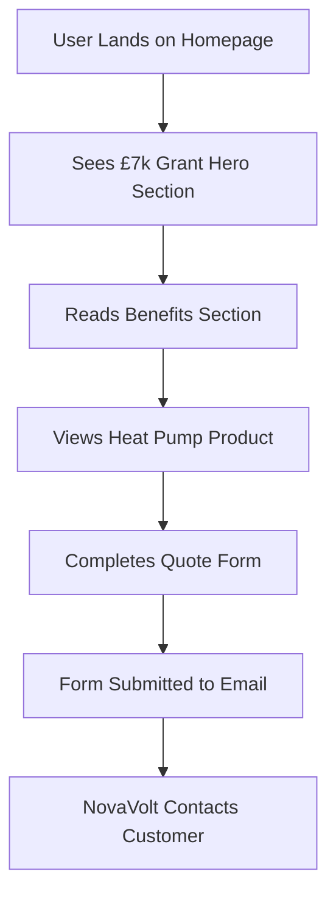

## 1. Product Overview
NovaVolt is a professional heat pump provider website that helps UK homeowners access £7,000 government grants for heat pump installations. The site targets homeowners seeking energy-efficient heating solutions and connects them with NovaVolt's services through a clean, modern interface that builds trust and credibility.

The website focuses on lead generation by capturing customer information through a quote request form, while educating visitors about heat pump benefits and available government funding.

## 2. Core Features

### 2.1 User Roles
No user authentication required - this is a single-page lead generation website where all visitors can access the same content and submit quote requests.

### 2.2 Feature Module
Our heat pump website consists of the following main pages:
1. **Home page**: hero section with £7,000 grant announcement, benefits section, heat pump showcase, quote request form, contact information.

### 2.3 Page Details
| Page Name | Module Name | Feature description |
|-----------|-------------|---------------------|
| Home page | Hero section | Display prominent "£7,000 Government Grant Available" headline with purple gradient background, subheading explaining eligibility, and call-to-action button leading to quote form |
| Home page | Navigation | Clean top navigation bar with NovaVolt logo, "Get Quote" button, and minimal menu items for professional appearance |
| Home page | Benefits section | Showcase 3-4 key benefits of heat pumps (energy savings, environmental impact, reliability, cost-effectiveness) with clean icons and concise descriptions |
| Home page | Product showcase | Display high-quality image of sleek black heat pump with brief technical specifications and installation information |
| Home page | Quote form | Contact form with name, email, postcode fields and submit button that sends lead information to business email address |
| Home page | Footer | Company contact details, privacy policy link, and professional business information |

## 3. Core Process
Users arrive at the homepage and immediately see the £7,000 government grant offer. They scroll through benefits and product information, then complete the quote request form with their contact details. The form submission sends their information via email to NovaVolt for follow-up.

## 4. User Interface Design

### 4.1 Design Style
- **Primary colors**: Deep purple (#6B46C1) and white (#FFFFFF) to create Octopus Energy association
- **Secondary colors**: Light gray (#F3F4F6) for backgrounds, dark gray (#374151) for text
- **Button style**: Rounded corners with subtle shadows, purple background with white text
- **Font**: Clean sans-serif (Inter or similar), 16px body text, 32px+ for headlines
- **Layout**: Card-based sections with generous white space, top navigation bar
- **Icons**: Minimal line icons in purple, professional business aesthetic

### 4.2 Page Design Overview
| Page Name | Module Name | UI Elements |
|-----------|-------------|-------------|
| Home page | Hero section | Full-width purple gradient background, large white headline text "£7,000 Government Grant Available", smaller subheading in white, prominent white "Get Your Quote" button with purple hover effect |
| Home page | Navigation | White background navigation bar with NovaVolt logo in purple text, right-aligned "Get Quote" purple button, minimal shadow effect for depth |
| Home page | Benefits section | Three white cards with purple icons, gray headings, black body text, equal spacing between cards, subtle hover animations |
| Home page | Product showcase | Left-aligned black heat pump image, right-side text content with purple accent headings, clean white background |
| Home page | Quote form | White card with purple border, clean input fields with gray borders that turn purple on focus, large purple submit button |
| Home page | Footer | Dark gray background with white text, professional business layout with contact information |

### 4.3 Responsiveness
Desktop-first design approach with mobile responsiveness. Hero section stacks vertically on mobile, benefits cards become single column, quote form maintains full width, navigation collapses to hamburger menu on screens below 768px.

### 4.4 3D Scene Guidance
Not applicable - this is a 2D business website focusing on clean, professional design.