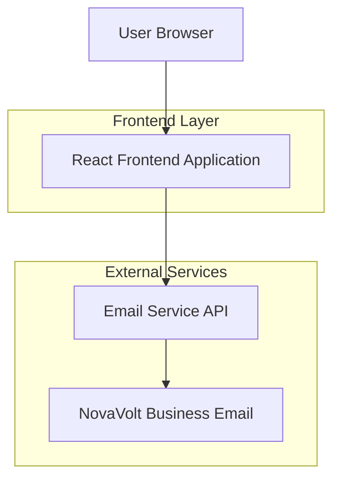

## 1. Architecture design



## 2. Technology Description
- Frontend: React@18 + tailwindcss@3 + vite
- Initialization Tool: vite-init
- Backend: None (email service integration only)
- Email Service: EmailJS or similar email API service

## 3. Route definitions
| Route | Purpose |
|-------|---------|
| / | Home page, displays the main landing page with hero section, benefits, and quote form |

## 4. API definitions

### 4.1 Email Integration API

Quote form submission
```
POST /api/send-quote
```

Request:
| Param Name| Param Type  | isRequired  | Description |
|-----------|-------------|-------------|-------------|
| name      | string      | true        | Customer full name |
| email     | string      | true        | Customer email address |
| postcode  | string      | true        | Customer postcode for service area |

Response:
| Param Name| Param Type  | Description |
|-----------|-------------|-------------|
| success   | boolean     | Email sent status |
| message   | string      | Status message |

Example
```json
{
  "name": "John Smith",
  "email": "john@example.com",
  "postcode": "SW1A 1AA"
}
```

## 5. Server architecture diagram
Not applicable - this is a static frontend application with email service integration.

## 6. Data model
Not applicable - no database required for this lead generation website.